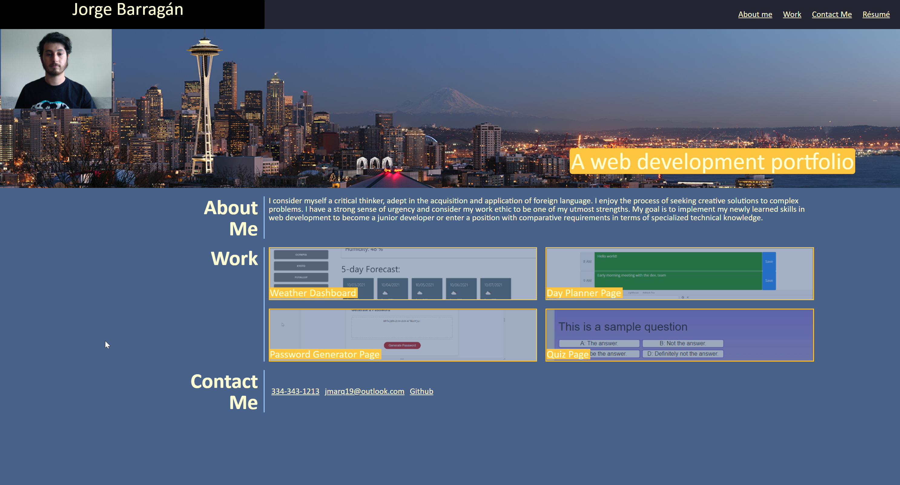

# <first-Portfolio>
## Description
This page serves as my first web development portfolio with links to the pages I have developed so far.
- My motivation for building this page was to have a concise portfolio.
- I built this page to have a place to link and showcase my work during the coding boot camp.
- I used my knowledge of CSS and the grid system to build this page.
## Table of Contents
If your README is long, add a table of contents to make it easy for users to find what they need.
- [Installation](#installation)
- [Usage](#usage)
- [Credits](#credits)
## Installation
The page can be reached by clicking [this link](https://jmarq019.github.io/first_portfolio/).
## Usage
This page is used by clicking on the links to access the correspoding page. See the screenshot below

## Credits
Credits to the UW coding bootcamp including instructors, TA's and tutors for giving me the knowledge in HTML and CSS which was used to produce this page.
## Tests
Testing the page and its responsiveness was done directly in browser. 